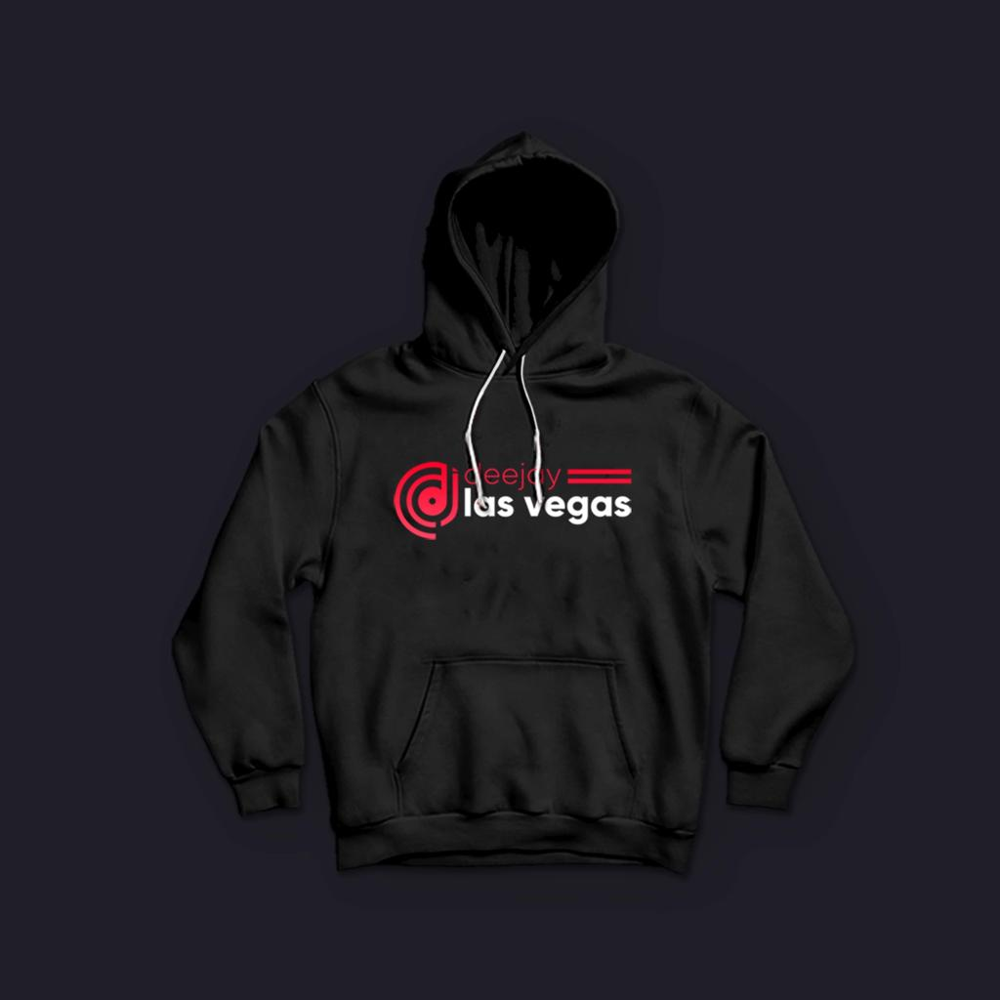

<!DOCTYPE html>

  <!--configurando metadados do site-->
 
<meta name="referrer" content="origin-when-crossorigin" id="meta_referrer" />
<html lang="pt" > <head><meta http-equiv="content-language" content="pt-pt" /> 
<meta charset="utf-8" /> 
<meta http-equiv="X-UA-Compatible" content="IE=edge" />
<meta name="viewport" content="width=device-width, initial-scale=1" /> 
<meta name="robots" content="index,follow,max-image-preview:large,max-snippet:-1,max-video:-1" /> 
<meta name="googlebot" content="index,follow,max-image-preview:large,max-snippet:-1,max-video-preview:-1" />
 <!-- dizendo aos crawlers para não ter uma box com input de pesquisar-->
     <meta name="google" content="nositelinkssearchbox"> 
     <!-- dizendo aos crawlers qu a pesquisa pode ser feita por voz-->
     <meta name="robots" content="translate" /> 
     <meta name="dcterms.language" content="pt"> 
     <meta http-equiv="content-language" content="pt" />
     <meta name="rating" content="general" />
     <!-- dizendo aos crawlers que este conteúdo pode ser acessado por todo mundo-->
     <meta name="distribution" content="global">
     <meta name="google" content="pagereadaloud" /> 
     <link rel="canonical" href="https://www.Djlasvegas.com"/> 

  <title>DJ Las Vegas - As melhores tracks 2021</title>  
  <meta name="keywords" content="melhores tracks,musica,dj,melhor dj,imagens de festa,alta qualidade,dowload de musica,beat,serviços para festas,musicas 2021" /> 
  <meta name="dcterms.type" content="Service">   
  <link rel="alternate" hreflang="pt" href="https://www.Djlasvegas.com"/>  
  <link rel="shortcut icon" href="" sizes="32x32" />
  <!-- especificando o email dos responsaveis pelo site--> 
  <meta name="reply-to" content="Serviços@TechBrains" /> 
  <meta name="description" content="" />  
 <!-- open graph -->
<!-- dando permissão para compartilhar com as redes sociais e descrevendo  o que deve aparecer -->
  <meta property="og:title" content="Dj las vegas - As melhores tracks" />
  <meta property="og:type" content="website" /> 
<meta property="twitter:description" content=" " />
  <meta property="og:locale" content="pt_pt" /> 
  <meta property="og:url" content="https://www.Djlasvegas.com/" />
  <meta property="og:site_name" content="Dj las vegas" />    
  <meta property="og:image" content=" " />
  <meta property="og:image:width" content="1200" />
  <meta property="og:image:height" content="630" />  
    <meta property="og:image:type" content="image/png" />  
<meta property="article:published_time" content="2021-01-21T16:10:06+00:00" />

<!-- twitter open graph -->
 
<meta property="twitter:url" content="https://www.Djlasvegas.com/">
<meta property="twitter:title" content="Dj las vegas - As melhores tracks" />
<meta property="twitter:description" content=" " />
<meta property="og:image" content=" " /> 
<meta property="twitter:type" content="article" /> 
<meta property="twitter:site" content="@Djlasvegas" />   
<meta name="twitter:card" content="summarylarge_image" /> 
<meta name="twitter:image:alt" content="Dj las vegas- as melhores tracks" />

<meta name="generator" content="Visual Studio Code" /> 
<link rel="alternate" hreflang="br" href="https://www.Djlasvegas.com/br/" />
<link rel="alternate" hreflang="ao" href="https://www.Djlasvegas.com/ao/" /> 
 
<!-- pre-carregando no momento de renrização-->
<meta rel="preload" as="image" href=""/>
<meta rel="preload" as="document" />
<meta rel="preload" as="style" href="index.css"/>
<meta rel="preload" as="script" />

<link rel='dns-prefetch' href='//www.google.com' />
<link rel="preconnect" href="https://www.youtube.com" >

<link rel="stylesheet" type="text/css" href="index.css">
    <link rel="stylesheet" href="https://cdnjs.cloudflare.com/ajax/libs/font-awesome/4.5.0/css/font-awesome.css">
 </head>     
 
 
<body> 
   
<!--slide -->
    

       
<label class="slideshow image1"></label>
<label class="slideshow image2"></label>
<label class="slideshow image3"></label>
<label class="slideshow image4"></label>
<label class="slideshow image5"></label>
<label class="slideshow image6"></label>

 
 
<!--fim do slide -->
 
 
  <hgroup class="hgroup"> 
  <h1 class="cabecalho1_musica">DJ Las Vegas</h1>
  <h2 class="cabecalho2_musica">As melhores tracks de sempre voçê encontra aqui!</h2>
 </hgroup>  
<!-- aqui entra um section -->
  
<!-- fim de section -->

 <section class="section_musica">
 <article> 
 <main>
 

 
  <hgroup class="musica"> 
          <h2>Músicas</h2>
          <h3 class="cabecalho4_musica">Todas as tracks 2021 do Dj Las Vegas, disponiveis aqui para ouvir e fazer o download</h3>
  </hgroup>

       
   
       
 
          
 <table class="table_music" cellspacing="30">
    <tbody >
       <tr class="tr_music" > 
        

          <td class="td_image td_image1">
             
             <a href="#" rel="follow" class="hyper_text_link"> 
              <figure class="figure_logo">
                
               </figure>
                <!--apresentando as imagens de capa que serão armazenadas no banco de dados aqui !--> 
                
              <h4  class="legenda_da_musica">  
            
<!--titulo da imagem aqui!-->Dj Las Vegas
 
          
<!--autor da musica aqui! -->Vamos Lá mais não é para lutar
  
       </h4> 
     </a> 
      </td>    
        </tr>  
          </tbody>
            </table>    
          
   
         <label>   
        
 
      </label>
     
 
    </main> 
  </article> 
  </setion>

<!-- aqui entra um section -->
<section>
  

</section>
<!-- fim de section -->

<!--dashboard-->
  <section class="section_cabecalho"> 
 <header class="header">
 

 
 <nav role="navigation" id="nav_dasboard">
 
    <input type="checkbox" id="menu-hamburguer" class="checkbox">
   <label for="menu-hamburguer"> 
    

      
    
 
   </label>  

<figure class="check">
  
</figure> 

<!--menu-->
 <aside class="aside_dashboard"> 

 
 <ul class="dashboard_ul">

   <li class="dashboard_li"><a href="#" class="dashboard_a home" rel="follow" title="Home"> <i class="fa fa-home"></i>  
   Home</a> </li>
   <li class="dashboard_li"><a href="#" class="dashboard_a dashboard_a_hover" rel="follow" title="Música"> <i class="fa fa-music"></i> Música</a></li>
   <li class="dashboard_li"><a href="#" class="dashboard_a dashboard_a_hover" rel="follow" title="Galeria"> <i class="fa fa-picture-o"></i> Galeria</a></li>
   <li class="dashboard_li"><a href="#" class="dashboard_a dashboard_a_hover" rel="follow" title="Sobre"> <i class="fa fa-support"></i> Sobre</a></li>
   <li class="dashboard_li"><a href="#" class="dashboard_a dashboard_a_hover" rel="follow" title="Contatos"> <i class="fa fa-phone"></i> Contatos</a></li> 
 </ul> 
 <!--fim -->

<!--redes sociais -->

  
   Siga-nos na internet
             
        <ul class="redes_social_ul">
          <li class="redes_social_list"><a href="https://www.facebook.com" rel="nofollow" class="facebook redes" title="facebook">
          <i class="fa fa-facebook" ></i></a></li> 
          <li class="redes_social_list"><a href="https://www.whatsapp.com" rel="nofollow" class="whatsapp redes" title="whatsapp">
          <i class="fa fa-whatsapp"></i></a></li> 
          <li class="redes_social_list"><a href="https://www.instagram.com" rel="nofollow" class="instagram redes" title="instagram">
          <i class="fa fa-instagram"></i></a></li> 
          <li class="redes_social_list"><a href="https://www.youtube.com" rel="nofollow" class="youtube redes" title="youtube">
          <i class="fa fa-youtube"></i></a></li>
               
        </ul> 

 <!--fim-->

 </aside>   
 </nav>  

 

  </header>
  </section>   
 <!--fim do dashboard --> 
 

<!--   backTop   -->
 

   <button onclick="backToTop()" id="btnTop_script" class="btnTop_style" autofocus="yes">
   <svg width="1em" height="1em" viewBox="0 0 16 16" class="icone_top" fill="currentColor" xmlns="http://www.w3.org/2000/svg">
   <path fill-rule="evenodd" d="M10 12.796L4.519 8 10 3.204v9.592zm-.659.753l-5.48-4.796a1 1 0 0 1 0-1.506l5.48-4.796A1 1 0 0 1 11 3.204v9.592a1 1 0 0 1-1.659.753z"/>
   </button> 
 

 </body>

 </html>

 
  

 <script>/**/ window.onscroll= function(){scroll();};function scroll(){let btn = document.getElementById("btnTop_script");if(document.documentElement.scrollTop > 50){btn.style.opacity= "1";btn.style.right="1%"; }else{btn.style.opacity= "0";btn.style.right="-20%";btn.style.transition="1.1s";}}function backToTop()
